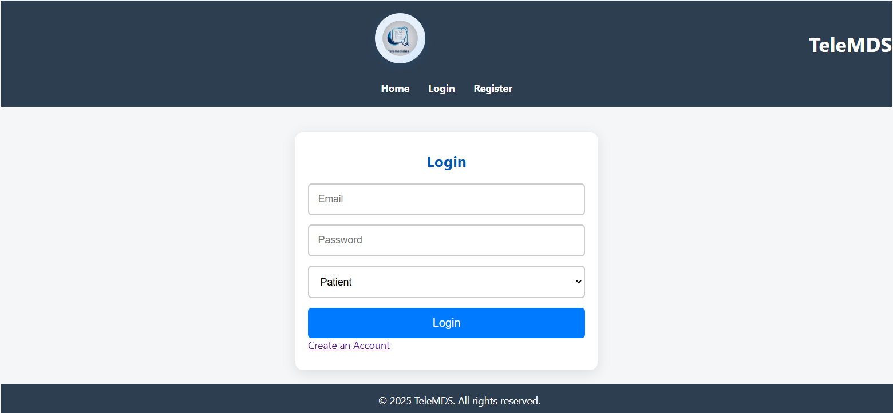
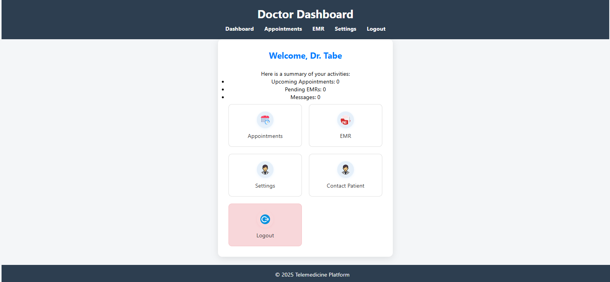

# TeleMDS: Telemedicine Platform for Rural Cameroon

## Overview
TeleMDS is a web-based telemedicine platform designed to connect patients and doctors, manage appointments, and facilitate remote healthcare for rural Cameroon. The system supports multiple user roles (patients, doctors, superadmin) and provides dashboards, appointment booking, EMR management, and more.

---

## How to Run the Application
1. **Clone or download this repository to your local machine.**
2. **Set up XAMPP/LAMP or any PHP environment.**
3. **Import the database:**
   - Use the full backup at `database/main.backup/telemeds_db_updated.sql` to create the database and tables. (All migrations are already included in this backup.)
4. **Access the application:**
   - If using Apache (XAMPP/LAMP), you do NOT need to start the PHP server manually. The included `.htaccess` file will automatically route all requests to the `public/` directory, so visiting the root URL (e.g., `http://localhost/telemds/`) will serve the landing page in `public/index.php`.
   - If you prefer, you can still use `php server.php` to start the PHP built-in server for development.

---

## Features
- **User Authentication:** Patients, doctors, and superadmin login with role-based dashboards.
- **Appointment Booking:** Patients can book appointments, describe symptoms, set urgency, and upload files.
- **Doctor Approval:** Superadmin can approve doctors and manage the doctor list.
- **EMR Dashboard:** Doctors and patients can view medical records.
- **Contact System:** Patients can contact doctors; doctors can contact patients.
- **Admin Management:** Superadmin dashboard for managing doctors and approvals.
- **Role-Based Access:** Pages and menus are tailored to user roles.

---

## Project Structure
```
telemds/
├── backend/                # Node.js backend (if used)
├── database/               # SQL schema, migrations, and backups
├── public/                 # Main PHP app, UI, and assets
│   ├── css/                # Stylesheets
│   ├── icons/ images/      # UI assets
│   ├── js/                 # JavaScript (minimal, mostly PHP-driven)
│   ├── php/                # PHP logic (login, register, booking, etc.)
│   ├── admin-dashboard.php
│   ├── appointments.php
│   ├── book.php
│   ├── contact-dashboard.php
│   ├── ddashboard.php      # Doctor dashboard
│   ├── emr-dashboard.php
│   ├── index.php           # Landing page
│   ├── login.php
│   ├── logout.php
│   ├── pdashboard.php      # Patient dashboard
│   ├── registration.php
│   ├── settings.php
│   ├── superadmin-dashboard.php
│   ├── users.php
├── .htaccess                # Routes all requests to public/ for Apache
├── run_sql_script.php      # Run SQL migrations from PHP
├── server.php              # Start PHP dev server
├── README.md               # This file
```

---

## User Roles & Demo Credentials
- **Super Admin:**
  - Access: `/superadmin-dashboard.php`
  - Username: `superadmin`
  - Password: `superadmin2025`
- **Doctor/Patient:**
  - Register via `/registration.php` or use seeded users in the database.

---

## API Usage
Most logic is handled via PHP forms, but some endpoints return JSON for dynamic UI:

- `public/php/get_doctors.php` — Returns a JSON array of all doctors:
  ```json
  [
    { "id": 1, "name": "Dr. John Akafor", "specialty": "General" },
    ...
  ]
  ```
- `public/php/book_appointment.php` — (If using JS) Accepts POSTed JSON for booking appointments:
  ```json
  {
    "patient_id": 1,
    "doctor_id": 2,
    "specialty": "General",
    "time_slot": "2025-06-15T10:00"
  }
  ```
  Returns:
  ```json
  { "message": "Appointment booked" }
  ```

---

## Screenshots
> _screenshots of the login page, dashboards, and booking form here for better reference._

Example:




---

## Contribution Guidelines
1. **Fork the repository and create a new branch for your feature or bugfix.**
2. **Follow the existing code style and structure.**
3. **Document any new features or migrations in the README.**
4. **Test your changes locally before submitting a pull request.**
5. **Submit a pull request with a clear description of your changes.**

---

## Security & Best Practices
- Passwords are hashed using PHP's `password_hash`.
- Role-based access enforced in PHP for all sensitive routes.
- File uploads are stored in `/uploads` and validated for type.
- Sessions are used for authentication.

---

## License
MIT License

---

## Notes on Routing & Entry Point
- The project root contains a `.htaccess` file that ensures all requests are routed to the `public/` directory, making `public/index.php` the main entry point for the app.
- If you access the project root directly, you will be redirected or routed to the landing page in `public/index.php`.
- This setup allows you to use the app without starting the PHP built-in server from the CLI.

---
For questions or contributions, please contact the project maintainer.
